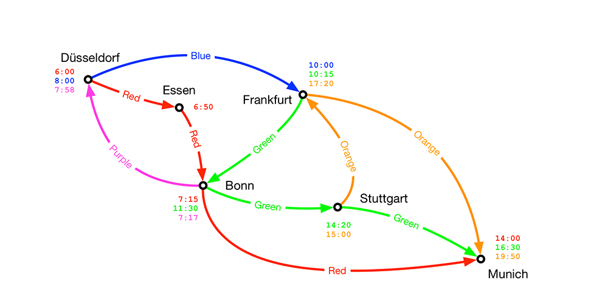

# Exercise > Calculate connections asynchronously and parallelized



- In this exercise, you will implement an version of the `connections`
  method that has the following properties:

  - It should perform the calculation asynchronously. Hence it will
    return a `Future[Set[Seq[Hop]]]`
  - It should, when present, exploit parallelism of the underlying
    compute infrastructure

**Step** **by** **step** **instructions**

- Start from a copy of the non-tail recursive version of the 
  `connections` method
- Rename the method to `connectionsAsync` and define it to return
  an instance of `Future[Set[Seq[Hop]]]`
- What other change needs to be applied to the `connections` method
  parameter list[s] in order to enable to utilisation of `Future`s?
- Adapt the inner `connections` method to take a single argument `soFarF` 
  of type `Future[Vector[Hop]]` and that returns a `Future[Set[Vector[Hop]]]`

- Start by adapting the code to do the first call to the inner
  `connections` method:
  
     `nextHops flatMap (hop => connections(Vector(hop)))`

- Apply the "let-the-types-guide-you" principle:
  - Look at the type of the elements you have and the type of what
    you need to produce
  - You will run into the situation where the nested types are
    "in the wrong order"

**Hints**:
  - `Future.sequence` will certainly be part of the solution
  - Also consider applying `map` or `flatMap`

- If you manage to adapt the code for the first call to the inner
  `connections` method, you should be able to adapt the code in
  the inner method using the same principles
- You may need one extra step in the inner method to account for the
  fact that a `Future` is passed as an argument instead of a 
  concrete value

- Use the `test` command to verify the solution works as expected

- Use the `nextExercise` command to move to the next exercise.

# Verify that the asynchronous version parallelises the algorithm

We have introduced concurrency in the implementation, but the question is,
will this result in parallel execution of some of the concurrent tasks?

In order to find out, let's add some basic for of logging by adding a `log`
method in the JourneyPlanner source file using the following definition:

```scala
  def log(msg: String): Unit = {
    println(s"${System.currentTimeMillis()} - ${Thread.currentThread.getName}: $msg")
  }
```

Now add a logging statement in the inner (recursive) `connections` method like so:

```scala
        log(s"connections: ${soFar}")
```

Place this statement at a location so that it is invoked each time the inner
connections method is called.

We could run the `com.lightbend.training.scalatrain.JournalPlannerSpec`, as this
runs the asynchronous implementation of the `connections` method. Problem though is
that, for other reasons, the testing system runs the tests on a single thread.
This can be verified by running the tests and observing that each invocation runs
on the same thread.

So, we need to write a small application that will execute the method.

Therefore, create a new Scala source file (`AsyncConnectionsMain`) and an object
with the same name that extends `App`.

Copy the test data object (`exercises/src/test/scala/com/lightbend/training/scalatrain/TestData.scala`)
into the new source file.

In object `AsyncConnectionsMain`, import `TestData._`.

Run the asynchronous connections method like so:

```scala
  val connections = planner.connectionsAsync(dusseldorf, munich, Time(6,0))
```

Note that you will need to provide an implicit ExecutionContext. The easiest way
to do this is to import `scala.concurrent.ExecutionContext.Implicits.global`.

Run the application and observe parallelism.

Congratulations: you have completed the course!

# Bonus exercise

The single `soFarF` parameter to the inner `connections` method is a
`Future[Vector[Hop]]`. It is relatively straightforward to refactor the code so
that `connections` takes a `Vector[Hop]`.

As a bonus exercise, do this refactoring and re-run the `AsyncConnectionsMain`
main program. What has changed? Can you explain what you observe?

# Note:

Printing out the calculated connections in a readable format can be done using the
following helper method (defined in a companion object for the `JourneyPlanner`):

```scala
object JourneyPlanner {
    def printConnections(connections: Set[Vector[Hop]]): String = {
    val cs = for {
      (connection, index) <- connections.to(Vector).zipWithIndex
      hop <- connection
      departureTime = hop.departureTime
      arrivalTime = hop.arrivalTime
      trainInfo = hop.trainInfo
      from = hop.from
      to = hop.to
    } yield (index + 1, f"$trainInfo%30s - @ $departureTime: ${from.name}%-20s - @ $arrivalTime: ${to.name}%-20s")
    val t = cs.groupMap(_._1)(line => line._2).to(Vector).sortBy(_._1)
    val w = for {
      (index, v) <- t
      c = v.mkString("\n")
    } yield s"\nConnection $index:\n$c"
    w.mkString
  }
}
```
# LSL-E-lightbend-scala-language-expert
